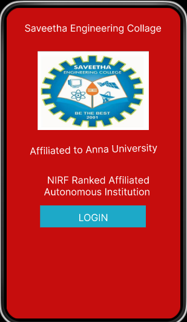
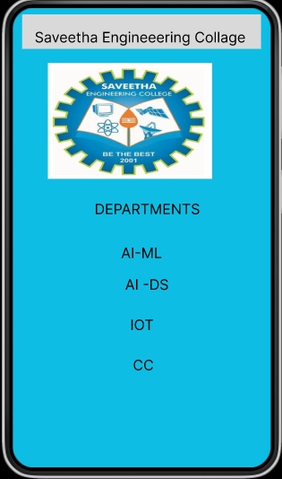

# Event Registration Web Application

## AIM:
To design, develop and deploy a web application for event registration.

## DESIGN STEPS:

### Step 1:
Create a new frame.

### Step 2:
Select any one preset size of your choice.

### Step 3:
Select the shapes you need.

### Step 4:
Import images as needed.

### Step 5:
Create pages based on your need and link them.

### Step 6:

Validate the HTML and CSS code.

### Step 6:

Publish the website in the given URL.

## DESIGN TOOL:
Figma
## Code

/* Home page */
box-sizing: border-box;
position: relative;
width: 360px;
height: 640px;
background: #C60D0D;
border: 1px solid #000000;

/* Drop Shadow */
box-shadow: 0px 4px 4px rgba(0, 0, 0, 0.25)
/* Login Page */
position: relative;
width: 364px;
height: 633px;
background: #A226A5;
/* Drop Shadow */
box-shadow: 0px 4px 4px rgba(0, 0, 0, 0.25);

/* SEC Page */
position: relative;
width: 360px;
height: 640px;
background: #0DBDE3;
/* Drop Shadow */
box-shadow: 0px 4px 4px rgba(0, 0, 0, 0.25);

## OUTPUT:

## RESULT:
The program to design, develop and deploy a web application for event registration is completed successfully.